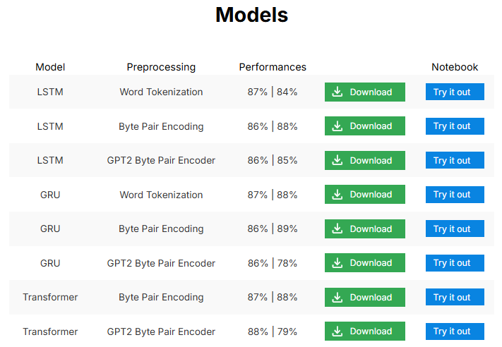

# MOVIE REVIEW CLASSIFIER

This repository is the portal to the the Comment Classifier Application. This application is AI Power and offers numerous models ready to be downloaded and multiple notebooks to test these models to find one that suits best your model. 

Alternatively, you can import a model and predict movie reviews class. This gives you multiple meaningful statistics on your data and classify the movie reviews by giving most common words used in each comment class. This is useful to derive insights on the general preferations of your public.

# DEVELOPMENT

This web dashboard is Flask powered and provides APIs to get results in json format. We built our models on Google Colaboratory with GPU units. We explore LSTMs, GRUs and Transformer Architecture. We intend to extend the project to the use of Generative Transformer Models. Feel free to contact us to participate in the process.

# BUILD THE PROJECT

You can see a requirements file at the bottom of the repository. To build the project, you will to create a virtual environment (every runs on Python) `python -m venv .venv` and install the requirements `pip install -r requirements.txt`.

To run it on local, you will need to run the `app.py` file in the terminal `python app.py`. This launches a server on client side in which you experience the dashboard. 